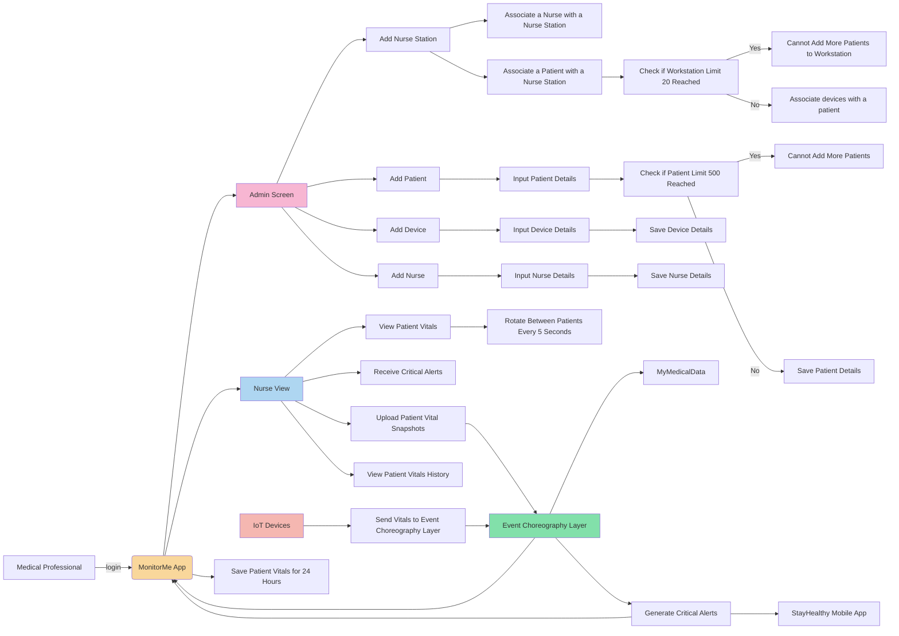

# Flow Chart

## Summary

### MonitorMe Software

The MonitorMe software is a comprehensive patient monitoring system that consists of two main components: an Event Choreography System and the MonitorMe Application.

#### Event Choreography System

This system is responsible for managing the event stream from patient monitoring devices. It performs the following functions:

- Receives vitals from patient monitoring devices and forwards them to the MonitorMe app.
- Generates alerts based on predefined thresholds.
- Sends these alerts to both the MonitorMe app and the StayHealthy mobile app.

#### MonitorMe Application

The MonitorMe app is a robust application that provides a range of functionalities:

- Displays patient vital signs in near real-time.
- Provides access to patient history for the last 24 hours.
- Shows critical alerts related to a patient's vitals.
- Allows uploading of filtered patient vital snapshots to the MyMedicalData application.
- Includes an admin screen for managing devices, patients, nurses, and nurse stations.

This flowchart is designed to provide a clear understanding of the different workflows within the MonitorMe software. It illustrates how the software effectively manages and communicates vital patient data, ensuring timely and accurate patient care.

## Diagram

## Supporting Documents

Icepanel C4: [MonitorMe Software Design](https://s.icepanel.io/g3InyI8xvmzngL/Z3NK)

