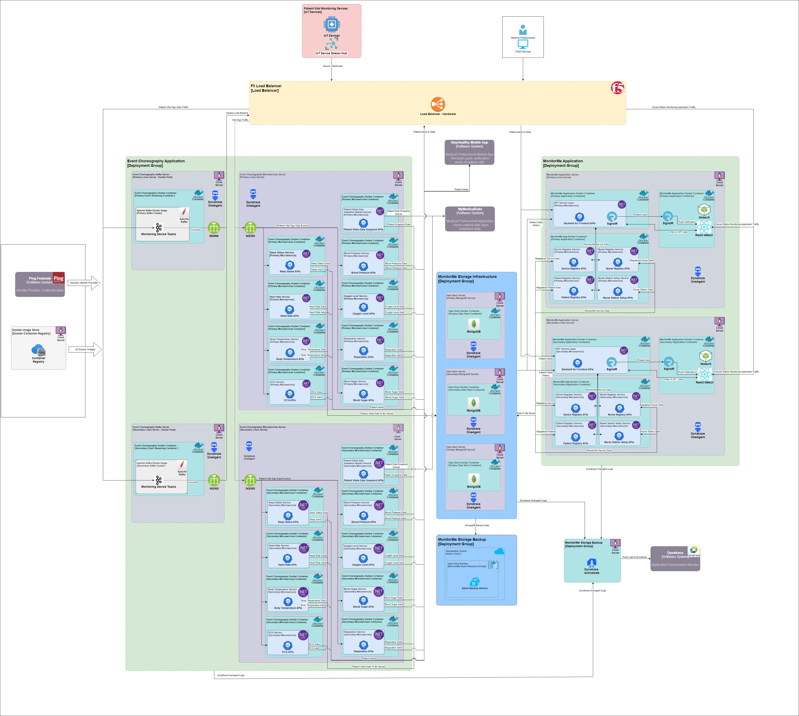

# System Overview

Please refer to the [business case and requirements](requirements.md) for reason and need for this system.

## Executive Summary

1. **Problem and Actors**:
   - We identified two key actors in our solution: **Patients/Devices** and **Medical Professionals**.
   - Our goal is to ensure that vital data can be transmitted independently, allowing Medical Professionals to promptly respond to critical health changes in patients.

2. **Architecture Patterns**:
   - We prioritized **Fault Tolerance** as our top concern.
   - To achieve this, we selected two architecture patterns:
     - **Event-Driven Architecture**: Enables seamless communication between components, ensuring fault tolerance.
     - **Microservices**: Provides flexibility, scalability, and fault isolation.
   - Trade-off: These patterns introduce higher complexity in the infrastructure.

3. **System Components**:
   - **MonitorMe** is divided into two systems:
     - **Event Choreography**: Handles event-driven communication and coordination.
     - **MonitorMe**: Focuses on vital data processing and presentation.

4. **Containerized Deployment**:
   - Our system is designed to run in containers.
   - Each vital's microservice will have its own container image.
   - Benefits:
     - Isolation of resources for meeting specific SLA needs.
     - Independent deployment and scaling.

5. **Data Storage and Resilience**:
   - We utilize **MongoDB** (NoSQL) for efficient write performance.
   - For data resilience, we employ **Azure Backup Service** for offsite storage of vital data.
   - Proper **RPO/RTO** (Recovery Point Objective/Recovery Time Objective) ensures data availability.

6. **Identity and Access Management**:
   - We rely on an **Identity Provider (e.g., Ping)** for robust Role-Based Access Control (RBAC).
   - Microservices authentication is also managed through this provider.

7. **Monitoring and Proactive Detection**:
   - **Dynatrace APM** provides proactive monitoring.
   - Synthetic transactions help ensure responsiveness.
   - Centralized log aggregation with AI detects system degradation.

In summary, MonitorMe's architecture prioritizes fault tolerance, responsiveness, and scalability while managing complexity. Our focus on independent vital data transmission ensures timely medical interventions. 🚀🏥

### Reference Material

- [Architecture Styles Worksheet](adr/supportingDocuments/architecture-styles-worksheet.pptx)
- [Architecture Characteristics Worksheet](adr/supportingDocuments/architecture-characteristics-worksheet.pptx)
- [User Flow Chart](diagrams/Flowchart.md)

## System Requirements

### Infrastrcuture Requirements

- X Linux OS Hosts
- X Servers with 4 CPU, 32 Core, 32 GB ram
- 1 F5 Load balancer appliance
- Dynatrace Cloud Instance in Azure
- Azure Backup Service

### Technology Stack

- Apacha Kafka 
- Ping Identity
- Dynatrace Application Performance Monitoring
- .NET Core Web API
- MongoDB
- SignalR WebSocket
- REACT Web UI
- NodeJS web hosting
- Azure Backup service